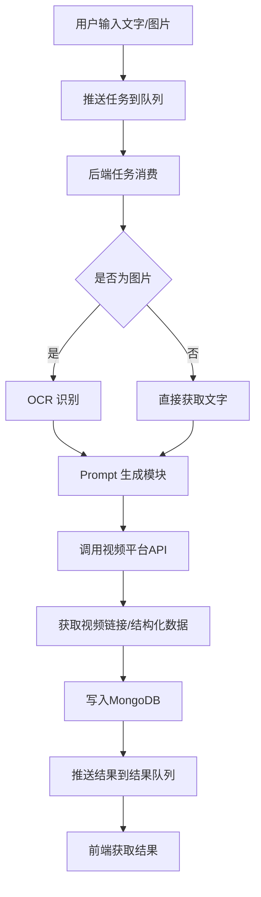

方案设计：AI 教学动画生成平台（队列与协议优化版）

## 一、系统架构与流程

1. **用户输入**  
   用户上传文字或图片内容，前端将输入封装为任务，推送到任务队列 Redis

2. **任务调度与处理**  
   后端服务监听队列，异步拉取任务，进入处理流程。

3. **OCR 识别（如有图片）**  
   对图片内容进行 OCR 识别，提取文字信息。

4. **Prompt 生成模块**  
   将用户输入的文字（或 OCR 结果）通过模板或大语言模型生成适合视频平台的提示词（Prompt）。

5. **第三方视频/动画平台对接**  
   调用如 Runway、Pika 等平台 API，提交 Prompt，生成教学动画或展示短片。

6. **结果结构化与存储**  
   获取生成的视频链接、提示词等结构化数据，写入 MongoDB 数据库。

7. **结果输出**  
   处理完成后，将结果推送到结果队列，前端轮询或通过 WebSocket 获取结果。

---

## 二、技术选型

- **后端服务**：Python (FastAPI+ Celery) 
- **队列中间件**：Redis 
- **数据库**：MongoDB（已集成，支持任务数据持久化）
- **OCR 能力**：百度 OCR / 腾讯 OCR API
- **Prompt 生成**：模板 + LLM（如 OpenAI GPT-4）
- **视频平台 API**：Runway、Pika 等
- **接口协议** protobuf 设计核心模块接口

---

## 三、流程图



---

## 四、模块拆解与协议设计

### 1. 输入处理模块

- 接收用户输入（文字/图片），封装为任务推送到队列

### 2. 核心接口协议（Protocol）

### 2. 核心接口协议（Protocol）

```protobuf
syntax = "proto3";

package ai_animation;

// 提交任务请求
message SubmitTaskRequest {
  string user_id = 1;
  string input_type = 2; // "text" 或 "image"
  string input_content = 3; // 文本内容或图片的url
}

// 提交任务响应
message SubmitTaskResponse {
  string task_id = 1;
  string status = 2; // "queued" 等
}

// 查询任务进度请求
message QueryTaskStatusRequest {
  string task_id = 1;
}

// 查询任务进度响应
message QueryTaskStatusResponse {
  string task_id = 1;
  string status = 2; // "queued", "processing", "finished", "failed"
  string result_url = 3; // 生成视频链接（如已完成）
  string error_message = 4; // 错误信息（如失败）
}

// 任务列表请求
message ListTasksRequest {
  string user_id = 1;
  int32 page = 2;
  int32 page_size = 3;
}

// 任务列表响应
message ListTasksResponse {
  repeated TaskInfo tasks = 1;
  int32 total = 2;
}

message TaskInfo {
  string task_id = 1;
  string status = 2;
  string created_at = 3;
  string result_url = 4;
}
```

### 3. 队列任务处理模块

- 使用 Celery/RQ 等消费任务队列，串联 OCR、Prompt、视频生成、存储等模块
- **任务处理时间**：统一设置为3秒，便于测试和调试

### 4. 结果输出模块

- 结果推送到结果队列，前端可长轮询或通过 SSE 获取

### 5. 数据存储模块

- **MongoDB集成**：已实现任务数据的MongoDB持久化存储
- **容错机制**：MongoDB连接失败时自动降级到文件存储
- **数据索引**：为task_id和user_id创建索引，提升查询性能

---

## 五、优势说明

- **队列机制**：实现任务异步处理、削峰填谷、解耦前后端，提升系统可扩展性和稳定性。
- **Protocol 协议**：核心模块接口协议化，便于后续扩展和单元测试，支持多种实现方式（如不同 OCR、视频平台等）。
- **MongoDB集成**：提供可靠的数据持久化，支持复杂查询和索引优化。
- **统一处理时间**：所有任务模块统一3秒处理时间，便于测试和性能评估。

---